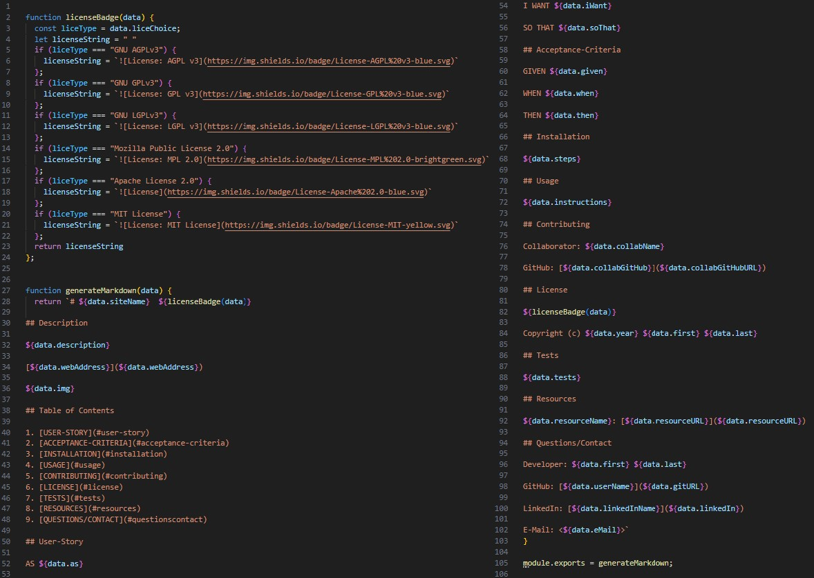

# README.md Generator  

## Description

This REPO was designed to help create a README.md file for future projects. I was motivated by my professor who assigned this project to our class. This will help myself, as well as others, create README's quickly for future REPO's being developed. During this project, I learned a lot about Node.js, Markdown, Licensing, and inserting badges to a README.md file.

[https://github.com/TheOarsman/README-Generator](https://github.com/TheOarsman/README-Generator)

## Table of Contents

1. [USER-STORY](#user-story)
2. [ACCEPTANCE-CRITERIA](#acceptance-criteria)
3. [INSTALLATION](#installation)
4. [USAGE](#usage)
5. [LICENSE](#license)  
6. [CONTRIBUTING](#contributing)
7. [TESTS](#tests)
8. [RESOURCES](#resources)
9. [QUESTIONS/CONTACT](#questionscontact)

## User-Story
   
AS a programmer designing REPOs

I WANT a README Generator that will put together a README.md file

SO THAT it is consistent and professional looking each time I make a new REPO

## Acceptance-Criteria

GIVEN a set of pre-made index.js and generateMarkdown.js files

WHEN the command ”node index.js” is run in an Integrated Terminal

THEN a series of prompts are given, and after answering them, professional README.md file is generated

## Installation
      
1 Clone repository from GitHub 2 In the index.js file, on line 148, rename "READMEtest.md" to "README.md" 3 Open an integrated terminal for the "index.js" file 4 Run "npm i" command to install all dependencies or devDependencies from the package. json file 5 Run "node index.js" to begin running Js file

## Usage

1 Verify installation steps have been completed 2 Verify an image/screen shot of your project is saved as a JPG file in your project. You will need this in order to display the image when prompted 3 Read prompts carefully and answer each thoroughly, then press Enter after answering each prompt 4 Once all prompts have been answered a "README.md" file will be generated 5 Copy/Paste new "README.md" file into your REPO
   
## Contributing

Collaborator: Myself, Heinz Ulrich V (using for video example)

GitHub: [TheOarsman](https://github.com/TheOarsman)

## License

Copyright (c) 2023 Heinz Ulrich V

## Tests

None, currently. More on this to come.

## Resources

Choose A License: [https://choosealicense.com/licenses/](https://choosealicense.com/licenses/)

## Questions/Contact

Developer: Heinz Ulrich V

GitHub: [TheOarsman](https://github.com/TheOarsman)

LinkedIn: [Heinz Ulrich V](https://www.linkedin.com/in/heinz-ulrich-v-3a3486a0/)

E-Mail: <heinzulrichv@gmail.com>